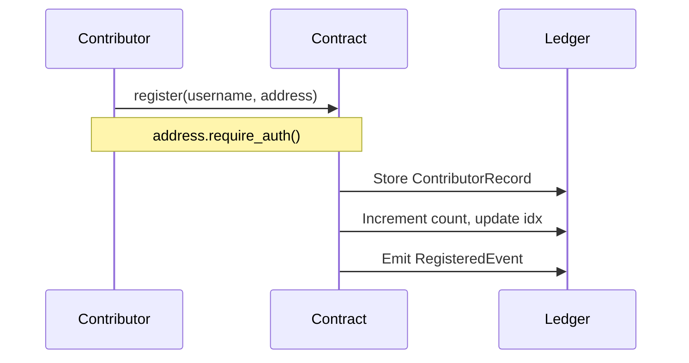
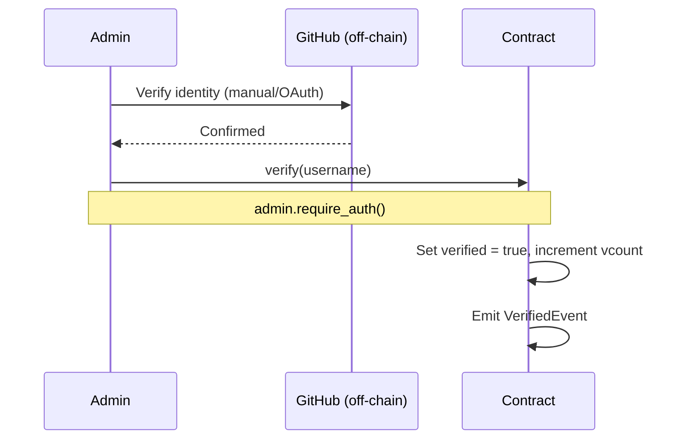

# Architecture

This document describes the design of **trustbridge-contract** — the on-chain GitHub username registry for TrustBridge on Stellar Soroban.

Related docs: [README](../README.md) · [ABI](ABI.md) · [DEPLOYMENT](DEPLOYMENT.md) · [CONTRIBUTING](CONTRIBUTING.md)

---

## System Context

TrustBridge connects open-source contribution on GitHub to Stellar-based rewards. This contract is the **identity bridge**:

```
GitHub username  ──register──►  Soroban contract  ◄──lookup──  GitHub Action / Dashboard
                                      │
                                      ▼
                               Stellar G-address
```

Consumers:

1. **Contributors** — register their GitHub → Stellar mapping
2. **GitHub Action** — resolves usernames to payout addresses at CI time
3. **Dashboard** — displays registry state, verification status, and stats
4. **Admin** — verifies identities off-chain and marks them on-chain

---

## Contract Modules

| Module | Responsibility |
|--------|----------------|
| `src/lib.rs` | Public contract interface (`TrustBridgeContract`), business logic, unit tests |
| `src/storage.rs` | Storage keys, `ContributorRecord` / `Stats` types, persistence helpers |
| `src/events.rs` | Soroban contract events with topics |
| `src/error.rs` | Typed error enum (`ContractError`) |

---

## Storage Layout

### Instance Storage (single contract instance)

| Key | Type | Description |
|-----|------|-------------|
| `Symbol("admin")` | `Address` | Contract administrator |
| `Symbol("count")` | `u32` | Total active registrations |
| `Symbol("vcount")` | `u32` | Count of verified registrations |
| `Symbol("idx")` | `Vec<String>` | Ordered list of registered usernames (for admin export) |

### Persistent Storage (per-entry, TTL-extended)

| Key | Type | Description |
|-----|------|-------------|
| `(Symbol("reg"), github_username)` | `ContributorRecord` | Per-user registration record |

### ContributorRecord

```rust
pub struct ContributorRecord {
    pub stellar_address: Address,
    pub registered_at: u64,   // ledger timestamp at registration/update
    pub verified: bool,       // set by admin after off-chain GitHub check
}
```

### Design Notes

- **`idx` index:** Soroban does not support iterating arbitrary storage keys. The username index enables `get_all_registered()` without scanning the entire ledger.
- **`vcount` counter:** Maintained incrementally so `get_stats()` is O(1) rather than scanning all records.
- **Re-registration:** Updating an existing username overwrites the record. If the Stellar address changes, `verified` resets to `false` unless the address is unchanged.

---

## Authorization Model

Soroban uses explicit address authorization via `Address::require_auth()`.

| Function | Who must authorize |
|----------|-------------------|
| `initialize` | No auth (one-time setup; protect deploy pipeline) |
| `register` | The `stellar_address` being registered |
| `remove` | The `caller` argument — must equal admin or registrant |
| `get_all_registered` | Admin |
| `verify` | Admin |
| `get_address`, `get_stats` | None (read-only) |

### Why `remove` takes a `caller` argument

Soroban contracts cannot inspect the transaction source account without an explicit argument. When multiple parties (registrant **or** admin) may call the same function, the contract requires `caller: Address` so it can:

1. Call `caller.require_auth()` to validate the signature
2. Check `caller == admin || caller == record.stellar_address`

See [Stellar auth documentation](https://developers.stellar.org/docs/build/smart-contracts/example-contracts/auth) for background.

---

## Event Design

All events use the `#[contractevent]` macro and are published on state changes.

### RegisteredEvent

| Field | Indexed (topic) | Description |
|-------|-----------------|-------------|
| `github_username` | ✅ | GitHub handle |
| `stellar_address` | | Mapped Stellar address |
| `timestamp` | | Ledger timestamp |

### RemovedEvent

Same shape as `RegisteredEvent` — emitted when a registration is deleted.

### VerifiedEvent

Same shape — emitted when admin marks a contributor as verified.

Events enable off-chain indexers and the TrustBridge dashboard to stay synchronized without polling all storage entries.

---

## Data Flow Diagrams

### Registration



### Admin Verification



---

## Error Handling

Errors are returned as `Result<T, ContractError>` (except auth failures, which trap via Soroban when `require_auth()` fails):

| Code | Variant | When |
|------|---------|------|
| 1 | `AlreadyInitialized` | `initialize` called twice |
| 2 | `NotInitialized` | Any function before `initialize` |
| 3 | `NotAuthorized` | `remove` caller is neither admin nor registrant |
| 4 | `NotRegistered` | Lookup/remove/verify on unknown username |
| 5 | `AlreadyVerified` | `verify` on already-verified record |

---

## Build Target

| Target | Status |
|--------|--------|
| `wasm32v1-none` | **Required** for `soroban-sdk` 26.x |
| `wasm32-unknown-unknown` | Unsupported on Rust 1.82+ with SDK 26 |

Release profile in `Cargo.toml`:

```toml
[profile.release]
opt-level = "z"
lto = true
```

---

## Future Considerations

- **TTL extension:** Persistent entries may need periodic TTL extension on mainnet; document in [DEPLOYMENT.md](DEPLOYMENT.md).
- **Username normalization:** Consider enforcing lowercase GitHub handles off-chain and in client SDKs.
- **Multisig admin:** Admin address can be a multisig or smart account — no contract changes required.
