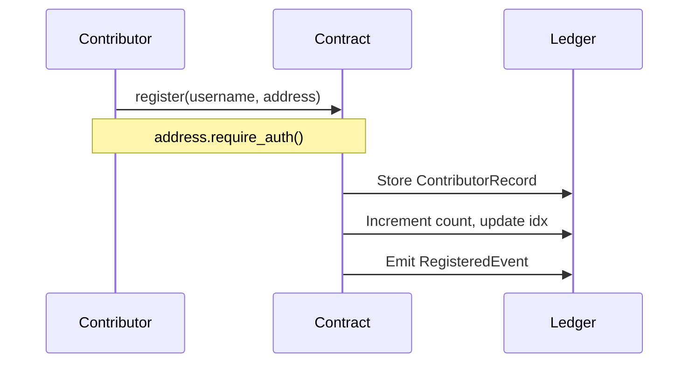
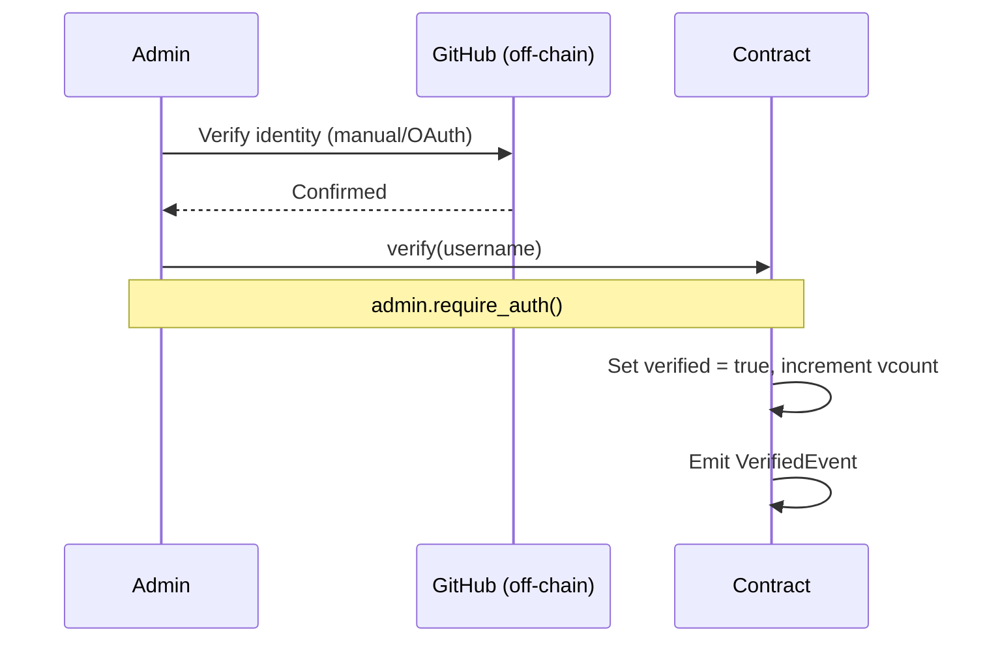
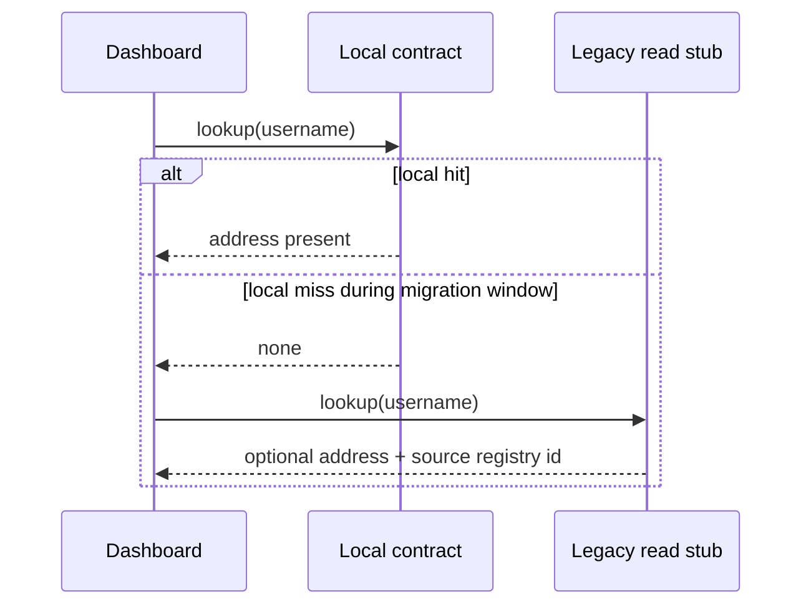

# Architecture

This document describes the design of **trustbridge-contract** — the on-chain GitHub username registry for TrustBridge on Stellar Soroban.

Related docs: [README](../README.md) · [ABI](ABI.md) · [DEPLOYMENT](DEPLOYMENT.md) · [CONTRIBUTING](CONTRIBUTING.md) · [CONTRACT_HEALTH](CONTRACT_HEALTH.md)

---

## System Context

TrustBridge connects open-source contribution on GitHub to Stellar-based rewards. This contract is the **identity bridge**:

```
GitHub username  ──register──►  Soroban contract  ◄──lookup──  GitHub Action / Dashboard
                                      │
                                      ▼
                               Stellar G-address
```

Consumers:

1. **Contributors** — register their GitHub → Stellar mapping
2. **GitHub Action** — resolves usernames to payout addresses at CI time
3. **Dashboard** — displays registry state, verification status, and stats
4. **Admin** — verifies identities off-chain and marks them on-chain

Operational monitors should use `get_health` (Issue #210) for a single packed
snapshot: pause state, schema version, registration counts, upgrade cooldown, and
attestation presence. See [CONTRACT_HEALTH.md](CONTRACT_HEALTH.md) for the full
reference and migration guide from manual probing.

---

## Contract Modules

| Module | Responsibility |
|--------|----------------|
| `src/lib.rs` | Public contract interface (`TrustBridgeContract`), business logic, unit tests |
| `src/storage.rs` | Storage keys, `ContributorRecord` / `Stats` types, persistence helpers |
| `src/events.rs` | Soroban contract events with topics |
| `src/error.rs` | Typed error enum (`ContractError`) |

---

## Storage Layout

### Instance Storage (single contract instance)

| Key | Type | Description |
|-----|------|-------------|
| `Symbol("admin")` | `Address` | Contract administrator |
| `Symbol("count")` | `u32` | Total active registrations |
| `Symbol("vcount")` | `u32` | Count of verified registrations |
| `Symbol("idx")` | `Vec<String>` | Ordered list of registered usernames (for admin export) |
| `Symbol("orgidx")` | `Vec<String>` | Ordered list of registered org names |
| `Symbol("tmidx")` | `Vec<String>` | Ordered list of team keys (org:name format) |
| `Symbol("ver")` | `(u32, u32, u32)` | Contract schema version tuple |

### Persistent Storage (per-entry, TTL-extended)

| Key | Type | Description |
|-----|------|-------------|
| `(Symbol("reg"), github_username)` | `ContributorRecord` | Per-user registration record |

### ContributorRecord

```rust
pub struct ContributorRecord {
    pub stellar_address: Address,
    pub registered_at: u32,   // ledger timestamp (u32 saves 4 bytes/record)
    pub verified: bool,       // set by admin after off-chain GitHub check
    pub entity_type: EntityType, // Personal, Org, or Team
    pub org_name: Option<String>, // org name for Org/Team entries
}

pub enum EntityType {
    Personal = 0,
    Org = 1,
    Team = 2,
}
```

### Design Notes

- **`idx` index:** Soroban does not support iterating arbitrary storage keys. The username index enables `get_all_registered()` without scanning the entire ledger.
- **`vcount` counter:** Maintained incrementally so `get_stats()` is O(1) rather than scanning all records.
- **Single-record reads are O(1) (Issue #291):** `has_record`, `get_address`,
  and `get_record_proof` resolve through a direct persistent-key lookup on
  `(REG_KEY, github_username)`. They never walk the flat `idx` index or the
  chunked index, so their cost is independent of the number of registrations
  and the number of chunks — a registry with 10k users across 200 chunks reads
  a single username in exactly the same number of storage operations as an
  empty one. The chunked index is only consulted by the explicitly paginated
  export paths (`get_public_paginated`, `get_registered_page`), never by point
  lookups. `has_record` additionally skips deserialization and the TTL bump
  that `get_record` performs.
- **Re-registration:** Updating an existing username overwrites the record. If the Stellar address changes, `verified` resets to `false` unless the address is unchanged.
- **Rent / Wave budgeting:** Dashboard UIs that estimate storage rent from N
  users should consume the versioned estimator inputs in
  [STORAGE_RENT_ESTIMATOR.md](STORAGE_RENT_ESTIMATOR.md) (on-chain rent only;
  indexer disk is separate).

---

## Authorization Model

Soroban uses explicit address authorization via `Address::require_auth()`.

| Function | Who must authorize |
|----------|-------------------|
| `initialize` | No auth (one-time setup; protect deploy pipeline) |
| `register` | The `stellar_address` being registered |
| `remove` | The `caller` argument — must equal admin or registrant |
| `get_all_registered` | Admin |
| `verify` | Admin **or** `Role::Verifier` |
| `revoke_verification` | Admin **or** `Role::Revoker` (Issue #212) |
| `start_challenge` / `cancel_challenge` / `complete_challenge` | Admin |
| `get_address`, `get_stats`, `get_health` | None (read-only) |

### Role matrix (Issue #212 — Verifier / Revoker split)

| Role | verify | revoke_verification | upgrade | set_role |
|------|--------|---------------------|---------|----------|
| Admin | ✅ | ✅ | ✅ | ✅ |
| Verifier | ✅ | ❌ | ❌ | ❌ |
| Revoker | ❌ | ✅ | ❌ | ❌ |
| Upgrader | ❌ | ❌ | ✅ | ❌ |

Separating Verifier from Revoker prevents a compromised Verifier key from
silently revoking payout eligibility for existing contributors.

**Migration for live Verifier holders:** Existing `Role::Verifier` addresses
keep their verify permission. If they previously relied on revoke, re-assign
them `Role::Revoker` via `set_role`.

### Why `remove` takes a `caller` argument

Soroban contracts cannot inspect the transaction source account without an explicit argument. When multiple parties (registrant **or** admin) may call the same function, the contract requires `caller: Address` so it can:

1. Call `caller.require_auth()` to validate the signature
2. Check `caller == admin || caller == record.stellar_address`

See [Stellar auth documentation](https://developers.stellar.org/docs/build/smart-contracts/example-contracts/auth) for background.

---

## Challenge-Period Flow (Issue #214)

Admin force-remove is normally instant. The challenge flow introduces a mandatory
delay so the registrant has time to prove GitHub ownership off-chain before a name
is freed.

### State machine

```
Registered
    │
    │  admin: start_challenge()
    ▼
[ChallengeActive] ──── resolve_after not yet passed ────────────────────────┐
    │                                                                        │
    │  registrant: remove()  (self-remove beats the clock, challenge cleared)|
    │  admin: cancel_challenge()                                             │
    ▼                                                                        │
Removed / Unlocked                                                           │
                                                                             │
                             resolve_after elapsed                           │
                                  ▼                                          │
                     admin: complete_challenge() ◄──────────────────────────┘
                                  │
                                  ▼
                             Removed + ChallengeCompletedEvent
```

### Rules

| Scenario | Outcome |
|----------|---------|
| `register` while challenge active | `ChallengeActive` error |
| Self-remove during challenge | Allowed; clears challenge atomically |
| `start_challenge` on already-challenged name | `ChallengeAlreadyActive` error |
| `complete_challenge` before delay | `ChallengeNotResolvable` error |
| Record removed during challenge window | `complete_challenge` returns `NotRegistered` |

### Events

| Event | Emitted by |
|-------|-----------|
| `ChallengeStartedEvent` | `start_challenge` |
| `ChallengeCancelledEvent` | `cancel_challenge` |
| `ChallengeCompletedEvent` | `complete_challenge` |
| `RemovedEvent` | `complete_challenge` (on successful removal) |

### Storage

Challenge records are stored under `(Symbol("chllng"), github_username)` in
persistent storage and TTL-extended on write. The default challenge delay is
`DEFAULT_CHALLENGE_DELAY_SECS` (48 hours).


## Event Design

All events use the `#[contractevent]` macro and are published on state changes.

### RegisteredEvent

| Field | Indexed (topic) | Description |
|-------|-----------------|-------------|
| `github_username` | ✅ | GitHub handle |
| `stellar_address` | | Mapped Stellar address |
| `timestamp` | | Ledger timestamp |

### RemovedEvent

Same shape as `RegisteredEvent` — emitted when a registration is deleted.

### VerifiedEvent

Same shape — emitted when admin marks a contributor as verified.

Events enable off-chain indexers and the TrustBridge dashboard to stay synchronized without polling all storage entries.

---

## Data Flow Diagrams

### Registration


```mermaid
sequenceDiagram
    participant U as Contributor
    participant C as Contract
    participant L as Ledger

    U->>C: register(username, address)
    Note over U,C: address.require_auth()
    C->>L: Store ContributorRecord
    C->>L: Increment count, update idx
    C->>L: Emit RegisteredEvent
```

### Admin Verification


```mermaid
sequenceDiagram
    participant A as Admin
    participant GH as GitHub (off-chain)
    participant C as Contract

    A->>GH: Verify identity (manual/OAuth)
    GH-->>A: Confirmed
    A->>C: verify(username)
    Note over A,C: admin.require_auth()
    C->>C: Set verified = true, increment vcount
    C->>C: Emit VerifiedEvent
```

---

## Error Handling

Errors are returned as `Result<T, ContractError>` (except auth failures, which trap via Soroban when `require_auth()` fails):

| Code | Variant | When |
|------|---------|------|
| 1 | `AlreadyInitialized` | `initialize` called twice |
| 2 | `NotInitialized` | Any function before `initialize` |
| 3 | `NotAuthorized` | `remove` caller is neither admin nor registrant |
| 4 | `NotRegistered` | Lookup/remove/verify on unknown username |
| 5 | `AlreadyVerified` | `verify` on already-verified record |

---

## Build Target

| Target | Status |
|--------|--------|
| `wasm32v1-none` | **Required** for `soroban-sdk` 26.x |
| `wasm32-unknown-unknown` | Unsupported on Rust 1.82+ with SDK 26 |

Release profile in `Cargo.toml`:

```toml
[profile.release]
opt-level = "z"
lto = true
```

---

## Cross-Contract Composability

Wave issue #149. Future TrustBridge contracts (payout, attestation) need to
answer "is this GitHub username registered, and verified?" without
maintaining a second copy of the registry. Soroban supports this natively:
any contract can call another contract's public functions directly via
`env.invoke_contract`, so no separate "reader" interface needed to be built —
the registry's existing read functions (`get_address`, `has_record`,
`get_stats`, `get_role`, …) already satisfy it.

The one design decision this forces is which functions are *appropriate* to
expose that way. A cross-contract call runs in the caller's authorization
context, so a sibling contract can never supply the registry admin's
signature — anything gated on `admin.require_auth()` (`get_all_registered`,
`get_registered_page`, `get_registered_paginated`) is unreachable
cross-contract by construction, not by an added check. That boundary, plus
the full list of what *is* safe to call, is documented in
[ABI.md § Cross-Contract Read Interface](ABI.md#cross-contract-read-interface).

Because the safe surface is entirely existing, already-deployed functions,
adopting it requires no storage migration and no new contract version for
existing v0.1 consumers — `Version::supports_cross_contract_reads()` pins the
compatibility floor at 1.0.0 for callers that want to assert it explicitly.

---

## Future Considerations

- **TTL extension:** Persistent entries may need periodic TTL extension on mainnet; document in [DEPLOYMENT.md](DEPLOYMENT.md). Estimator TTL schedule: [STORAGE_RENT_ESTIMATOR.md](STORAGE_RENT_ESTIMATOR.md).
- **Username normalization:** Consider enforcing lowercase GitHub handles off-chain and in client SDKs.
- **Multisig admin:** Admin address can be a multisig or smart account — no contract changes required.

## Migration Window Reads

During a registry migration window, dashboards should treat the on-chain
contract as the primary source and use the read-only legacy stub only as a
fallback for usernames that are not yet present locally.

Recommended order:

| Step | Call | Why |
|------|------|-----|
| 1 | Local contract lookup (`get_address`, `has_record`, or paginated export) | Prefer the authoritative on-chain record first. |
| 2 | External read stub | Only if the local lookup misses and the migration window is still open. |
| 3 | Local contract again after sync | Once a username is imported, the local record wins on subsequent reads. |

The stub interface is intentionally read-only and returns a deterministic
fixture in tests, so dashboards can exercise the dual-read flow without
introducing storage writes or ABI changes.


```mermaid
sequenceDiagram
    participant D as Dashboard
    participant C as Local contract
    participant S as Legacy read stub

    D->>C: lookup(username)
    alt local hit
        C-->>D: address present
    else local miss during migration window
        C-->>D: none
        D->>S: lookup(username)
        S-->>D: optional address + source registry id
    end
```
